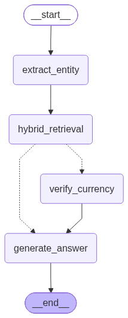

# Asistente RAG sobre dictámenes regulatorios de reevaluación de aditivos alimentarios (EFSA, Reglamento UE 257/2010)

[](https://www.python.org/)
[](https://www.langchain.com/)
[](https://www.langchain.com/langgraph)
[](https://streamlit.io/)
[](https://www.trychroma.com/)
[](https://modelcontextprotocol.io/)
[](https://www.deepseek.com/)

*(nombre técnico del repo: `efsa-additives-rag`)*

**Índice**
- [Alcance](#alcance)
- [Estado actual](#estado-actual)
- [Setup](#setup)
- [Aviso](#aviso)

**Demo pública:** [efsa-additives-rag.streamlit.app](https://efsa-additives-rag.streamlit.app/)

**Arquitectura:** RAG orquestado con LangGraph -- 4 nodos con
enrutamiento condicional (extracción de entidad -> retrieval híbrido ->
verificación de vigencia -> generación). El grafo compila a un flujo
fijo con una única bifurcación condicional (si el Nodo 1 no resuelve
ninguna sustancia, se salta el Nodo 3) -- no es un sistema agéntico con
bucle de decisión abierto: ningún nodo decide en tiempo de ejecución
qué herramientas invocar o en qué orden, la secuencia está fijada de
antemano.



## Alcance

Este proyecto cubre **exclusivamente** aditivos alimentarios en reevaluación
bajo el Reglamento (UE) n.º 257/2010 -- no pienso animal, no aromas, no
contaminantes, ningún otro programa regulatorio de EFSA.

- **315** aditivos alimentarios son elegibles para este programa: los
  aprobados en la Unión Europea antes del 20 de enero de 2009 (fuente:
  [EFSA, "Food additives"](https://www.efsa.europa.eu/en/topics/topic/food-additives)
  -- "the 315 food additives that were approved in the EU before 20 January
  2009").
- **162** dictámenes únicos identifica el corpus de este proyecto dentro de
  ese programa (filtro `Domain.FoodDomain == 'food additives'` + patrón de
  título de reevaluación, más rescate de dictámenes mal etiquetados con otro
  dominio -- ver `CLAUDE.md`, "Hallazgos verificados"). Corpus de trabajo
  verificado internamente, no contrastado contra una lista oficial cerrada
  de EFSA.
- **161** dictámenes corresponden a PDFs únicos ya descargados, troceados e
  indexados -- **67.827 fragmentos narrativos** en el índice de retrieval
  (Chroma), sobre 161/161 PDFs procesados sin errores.
- **247** sustancias del corpus tienen un enlace estructural resoluble a un
  dictamen vigente (la unidad comparable con las 315 elegibles: sustancia,
  no documento -- un solo dictamen puede cubrir varias sustancias a la vez,
  ver `CLAUDE.md`).

Estas cifras no se conflacionan entre sí a propósito: "dictámenes",
"PDFs" y "sustancias" son unidades de conteo distintas en este proyecto
-- ver `CLAUDE.md` si necesitas la cadena de joins exacta detrás de cada
una.

## Estado actual

Grafo completo implementado y ejecutado de extremo a extremo (Nodo 1 --
extracción de entidad -> Nodo 2 -- retrieval híbrido -> Nodo 3 --
verificación de vigencia -> Nodo 4 -- generación), probado con
consultas reales, no solo con mocks:
- `src/efsa_rag/ingestion/openfoodtox.py` -- cadena de joins
  determinista para ADI/TDI, vigencia y resolución de sustancias por
  dossier, verificada contra el xlsx real de OpenFoodTox 3.0.
- `src/efsa_rag/ingestion/pdf_chunking.py` +
  `src/efsa_rag/ingestion/chroma_index.py` -- los 161 PDFs del corpus
  troceados, embebidos (`sentence-transformers`, backend ONNX int8) e
  indexados en Chroma (ver "Alcance" arriba para las cifras exactas).
- `src/efsa_rag/graph/nodes.py` + `src/efsa_rag/graph/build.py` -- los
  4 nodos LangGraph conectados y compilados, incluida la restricción
  de comunicación de riesgo del Nodo 4 (el ADI nunca se redacta como
  umbral de toxicidad) y la resolución multi-candidato del Nodo 1:
  cuando varios nombres de `SUB.ChemicalName` son razonablemente
  parecidos a la sustancia mencionada en la pregunta (fuzzy matching
  con `rapidfuzz`, restringido a las 246 sustancias con dictamen
  resoluble del corpus, más normalización de guion/espacio para casos
  como "Alpha tocopherol" vs. "Alpha-tocopherol"), el sistema nunca
  elige uno en silencio -- resuelve y presenta todos los candidatos
  plausibles por separado, cada uno con su propio dictamen vigente y
  sus propios fragmentos narrativos, dejando que el usuario identifique
  cuál buscaba.
- `src/efsa_rag/mcp/server.py` -- servidor MCP con dos herramientas
  (`search_efsa_opinion`, `get_reevaluation_status`), ambas con esquema
  de salida rediseñado a **array de resultados siempre**
  (`{"candidates_found", "candidates_shown", "results": [...]}`) --
  nunca un objeto singular con un candidato elegido en silencio,
  consistente con la disciplina de resolución multi-candidato de
  arriba. Probado en aislamiento, todavía no con un cliente MCP real
  (Claude Desktop u otro).
- `src/efsa_rag/ui/app.py` -- demo Streamlit: candado de refresco 24h,
  límites de consulta por presupuesto diario, y descarga de los datos
  pesados desde MEGA S4 en el arranque.

Limitaciones conocidas y decisiones de diseño documentadas en `CLAUDE.md`.

## Setup

```bash
python -m venv .venv
source .venv/bin/activate
pip install -r requirements.txt
cp .env.example .env  # rellenar DEEPSEEK_API_KEY

# Descargar manualmente el export de OpenFoodTox 3.0 desde Zenodo
# (dataset "OpenFoodTox 3.0", ~22.6 MB) y colocarlo en:
#   data/raw/OFT3_0_export_repository.xlsx

pytest  # los tests de joins se saltan automáticamente sin el xlsx
```

Desplegado en Streamlit Community Cloud -- detalles técnicos del proceso
de deploy en `CLAUDE.md`/`PROGRESS.md` para quien quiera profundizar.

## Aviso

Herramienta de exploración de literatura regulatoria, no de asesoramiento
regulatorio ni médico.
